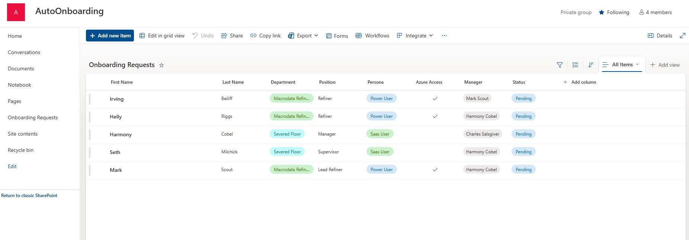
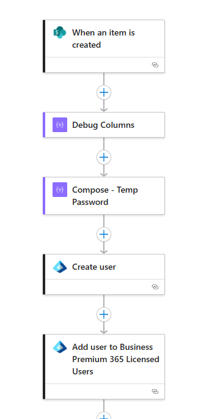
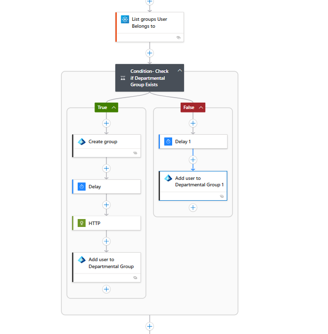
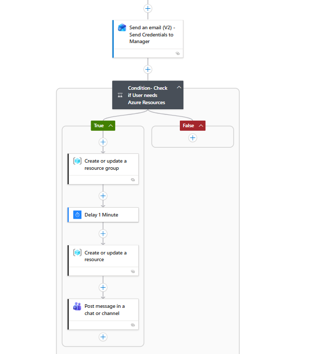
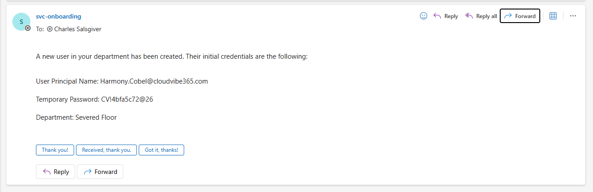
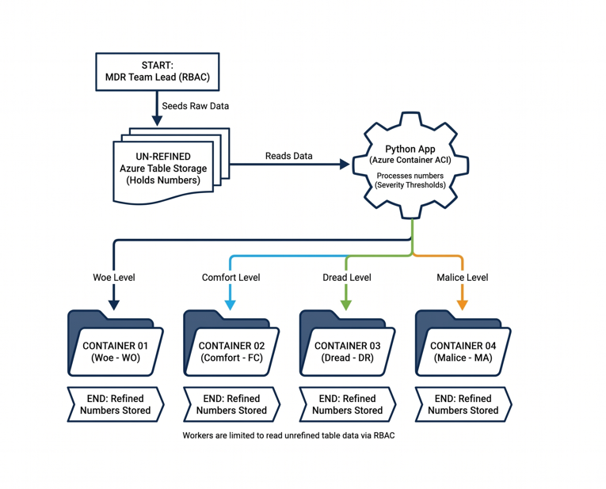
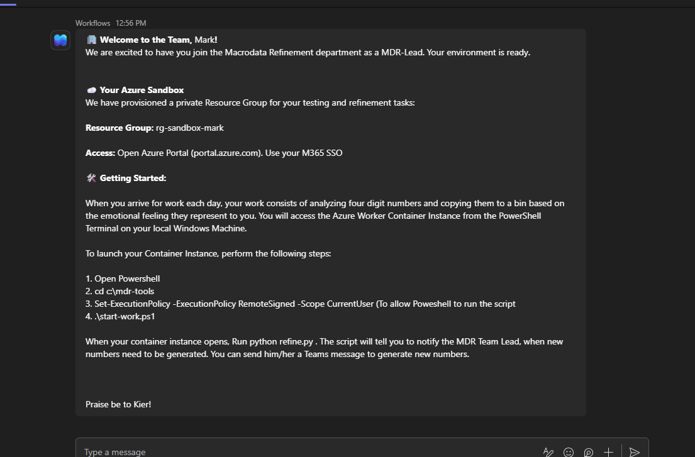

# Microsoft 365 and Azure Automated Employee Onboarding App

## Overview

  

<a href="https://youtu.be/NgU25HxfVfI">
▶️ Click above to watch a YouTube demo
 </a>

 

I created this project to demonstrate the capabilities of Microsoft Cloud technologies for onboarding employees. This project started for me as a cloud engineer to practice using Azure Services. When brainstorming new demo projects to work on I look to build something that could address real world business needs.

Onboarding employees creates bottlenecks in organization growth. The manual process of provisioning new identities and collaborative infrastructure is error prone and time consuming.

This particular project serves as a foundational template for future infrastructure-as-code initiatives within the organization. As I master new Azure Cloud Services, I can build upon this app to impliment more features.  

In this project, I use fictional departments and workflows from the Apple TV Series, “Severance”, a corporate and psychological satire which I highly recommend.

## The primary business needs this project solves:

**• Operational Efficiency:** By bridging the gap between SharePoint requests and Microsoft Entra ID, I eliminated the need for manual administrative overhead and reduced the time-to-productivity for new staff.

 **• Security & Governance:** I established a "Private by Default" architecture, ensuring that sensitive department data is restricted to authorized personnel from the moment a group is created.

**• Infrastructure Consistency:** The app automates the complex "teamification" of Microsoft 365 groups, providing a standardized collaboration suite—including SharePoint sites and Teams channels—for every department.

**• System Resiliency:** By implementing sophisticated logic to handle eventual consistency and API replication latency, I built a system that is robust enough to handle enterprise-scale onboarding without constant manual intervention.

### 1. The Request Gateway (SharePoint)
   
I created a SharePoint site called AutoOnboarding.  HR and department managers are members of this site. Within the site there is a SharePoint list named Onboarding Requests.  This list is what is used to initialize the provisioning of new employee identities. Schema of this list is as follows: 

| Column Display  Name | Data Type |	Description / Usage in Automation |
|----------------------|-----------|-------------------------------------|
|First Name|Single line of text|Used as the First Name field for user creation.|
|Last Name|Single line of text|Used as the Last Name field for user creation.|
|Department|Choice|Triggers the logic to check for/create the Unified Group.|
|Position|Single line of text|Maps to the Job Title attribute in the Entra ID profile.|
|Persona |Choice|Used to determine specific license assignments or software access levels.|
|Azure Access|Yes/No|A Boolean flag to determine if cloud resources should be provisioned.|
|Manager|Person or Group|Identifies the reporting line for the new user's Entra ID profile.|
|Status|Choice|Workflow state tracker (e.g., Pending, In Progress, Completed).|
|Modified|Date and Time|System-generated timestamp of the last change.|
|Created|Date and Time|System-generated timestamp when the request was submitted.|
|Created By|Person or Group|The identity of the individual who submitted the request.|
|Modified By|Person or Group|The identity of the last individual (or service account) to edit the item|
 

 

### 2. Orchestration Layer (Azure Logic Apps)
As new employees are added to this list, an Azure Logic app runs every 3 minutes to look for new items. If a new item is detected the logic app is triggers and creates a new Entra ID, M365 identity, provisions a M365 business premium license, automatically adds the employee to a departmental group, which is SharePoint, mail, and Teams enabled. 
 

 

 

*These three screen-captures show the design view of the logic app*

 

As the new Entra ID is created a line of logic code creates an initial temporary strong password based on a unique ID. The logic app then automatically emails the new employee’s departmental manager, notifying them of the new onboarded employee and provides the manager with the initial credentials for the new hire to log into M365 and Teams. A Teams message is automatically sent to the departmental team alerting the team and welcoming the new hire. 

 

*When a new employee is onboarded, an email such as this is automaticaly sent to their manager*

 

When a new employee is added to the Onboarding Requests list, a persona must be chosen (SAAS user, power user, or read only) and a Boolean choice of Azure Access is chosen. If Azure Access is required, the employee will be granted access to Azure Resources to perform their function.

### 3. Advanced Azure Integration (The "Refiner" Workflow)

In this simulated scenario, the only users needing Azure Access are in the Macro Data Refinement department. These engineers (refiners) use production storage accounts and a production container to refine large numbers. These large numbers are held in an un-refined Azure Table Storage container. They read this data into a Python app running on an Azure Container. As numbers are analyzed, refiners write them into one of four refined Azure Storage Containers, based upon the “emotional” or “scariness” level of the number. When all the numbers have been processed, the MDR Team Lead has RBAC permission to create new data on the unrefined storage container. 

 

*MacroData Refiners WorkFlow*

 

Each refiner will also be provided with an Azure sandbox environment where they can do testing. This sandbox consists of their personal resource group, where they may build storage accounts and containers instances. The logic app uses the SharePoint list to determine if a new employee will need this. There is a Boolean choice “Azure Access Required” that the logic app checks against. If it finds true, the app will provision a resource group and RBAC security based upon their name. 

Finally, the Logic App automatically sends a Teams message through a chatbot to the user, with instructions on how to get to their Azure resource group and how to start their daily work.

 

*Welcoming Teams Auto-Chatbot Message*

 

### Key Technologies Used
•	**Identity:** Microsoft Entra ID (User Management, Security Groups)

•	**Automation:** Azure Logic Apps, Microsoft Graph API

•	**Compute:** Azure Container Instances (ACI)

•	**Storage:** Azure Table Storage, Blob Storage

•	**Collaboration:** SharePoint Online, Microsoft Teams, Exchange Online

•	**AI Tools:** Google Gemini was utilized for Python Code help and Troubleshooting

### Future Roadmap
•	Automated Offboarding: A "Termination" trigger in SharePoint that revokes licenses, removes group memberships, and deletes the Azure sandbox.

•	Enhanced Persona Logic: Adding automated provisioning for specific SaaS apps (like GitHub or Jira) based on the "Persona" selected in the initial request.

